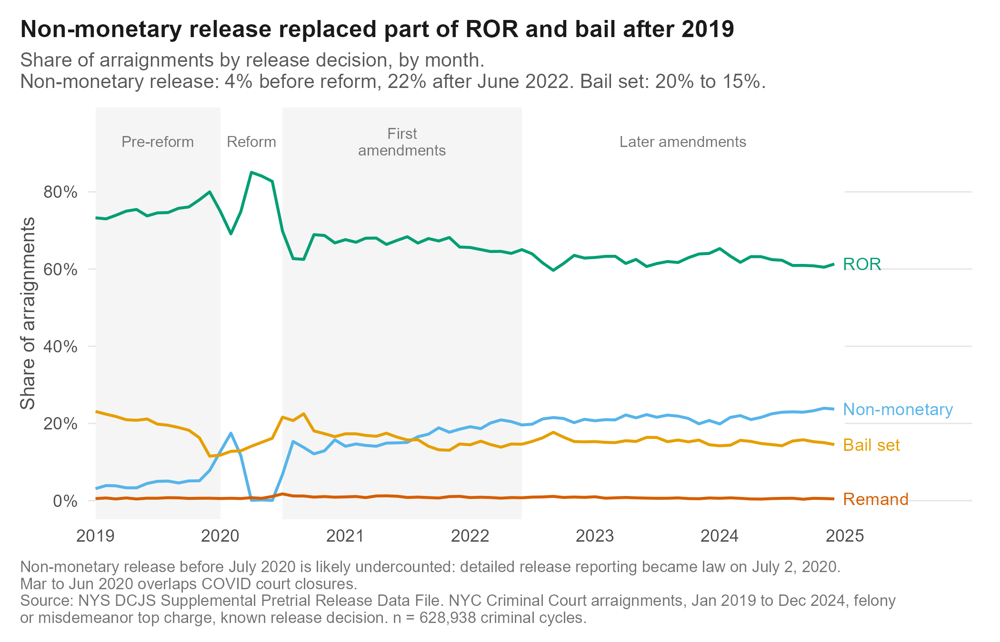

# NYC Pretrial Release Decisions Before and After Bail Reform, 2019 to 2024

How NYC judges' release decisions at arraignment changed across New York's bail reform and its amendments, using 628,938 NYC Criminal Court arraignments from the DCJS Supplemental Pretrial Release Data File. Built in R, SQL (DuckDB) and Quarto, with QA checks that reproduce the official DCJS summary tables exactly.

**Read the brief:** [`outputs/brief.pdf`](outputs/brief.pdf) · **QA report:** [`outputs/qa_report.md`](outputs/qa_report.md)

## Key findings

1. **Non-monetary release grew from 4% to 22% of decisions.** Between 2019 and the period after June 2022, ROR fell from 75% to 62% and bail set from 20% to 15%, while release with non-monetary conditions rose from 4% to 22%. The 2019 figure is likely undercounted (see Limitations).
2. **Bail or remand became less common in every charge group.** The restrictive rate (bail set or remand) fell from 11% to 7% for misdemeanors and from 61% to 47% for violent felonies. For violent felonies it kept falling after the 2022 and 2023 amendments, from 51% in 2022 to 45% in 2024.
3. **Charge and prior history had the strongest adjusted associations.** In a logistic model of post-reform arraignments (n = 512,960), a violent felony charge was associated with 14 times the odds of bail or remand compared with a misdemeanor, and an open case at arrest with 3.3 times the odds. After adjustment, odds for Black (OR 0.98, 95% CI 0.95 to 1.01) and Hispanic (OR 0.99, 95% CI 0.96 to 1.02) people were close to those for White people. This does not rule out disparity, because charge and prior history can themselves reflect earlier disparities in arrest and charging.
4. **Courts were already moving before the law took effect.** The reform was passed in April 2019 and took effect in January 2020. An interrupted time series shows the charge-adjusted bail or remand rate was already falling by 6.9 points a year from January to October 2019 (95% CI 6.1 to 7.6). Against that trend, the rate was still 6.1 points lower than predicted in January 2020 (95% CI 5.3 to 6.8).
5. **Released cases with conditions had higher failure rates, but conditions were not the cause.** After June 2022, 43% of non-monetary releases had a rearrest within 180 days, compared with 18% for ROR. Judges set conditions for people they see as higher risk, so this should not be read as an effect of the conditions. Within non-monetary releases, pretrial supervision and contact-only release had almost the same bench warrant and rearrest rates after adjustment.



## Data and population

- **Source:** NYS DCJS [Supplemental Pretrial Release Data File](https://criminaljustice.ny.gov/pretrial-release), arraignments 2019 to 2024. Download links, field definitions and caveats are in [`data/README.md`](data/README.md).
- **Unit:** one criminal cycle (arrest through final disposition). One person can appear more than once, so results are never counts of people.
- **Population:** NYC Criminal Court (lower court) arraignments, January 2019 to December 2024, felony or misdemeanor top charge, known release decision.

| Step | Rows |
|---|---:|
| Raw file | 1,379,219 |
| NYC only (county of first arraignment) | 773,952 |
| NYC Criminal Court arraignments | 766,638 |
| Arraigned Jan 2019 to Dec 2024 | 766,638 |
| Felony or misdemeanor | 766,536 |
| Known release decision (analysis population) | **628,938** |

Dates use the lower court arraignment month (`larg_yr`, `larg_mo`), not `arr_yr`, which is not a reliable arrest date in this file. All court fields use the lower court (`larg_*`) versions.

## Methods

- **Periods:** pre-reform (2019), reform (Jan to Jun 2020), first amendments (Jul 2020 to May 2022), later amendments (Jun 2022 to Dec 2024). Effective dates: Jan 1, 2020; Jul 2, 2020; May 9, 2022; June 2023.
- **Restrictive decision:** bail set or remand (1) vs ROR or non-monetary release (0).
- **Released:** ROR, non-monetary, or bail paid within 5 days (the DCJS definition).
- **Regression:** logistic model of a restrictive decision on charge group, firearm charge, prior felony conviction, open case at arrest, bench warrant in the prior 2 years, age group, sex, race and ethnicity, borough and period, post-reform arraignments only. 2019 is fitted separately. Robustness checks: without race (other odds ratios change by at most 1%) and with a charge-by-period interaction (improves fit; the felony gap varied by period).
- **Interrupted time series:** segmented regression of the monthly bail or remand rate, standardized to the 2019 to 2024 charge mix (69% misdemeanor, 15% other felony, 16% violent felony), with breaks at January 2020, July 2020 and June 2022. Newey-West standard errors allow for correlation between months. November and December 2019 are left out of the pre-trend fit because the rate dropped sharply as courts prepared for the law.
- **Condition types:** from 2020 on, a logistic model compares pretrial supervision with contact-only release for bench warrants and 180-day rearrest, adjusting for charge, history, demographics, borough and year.

## Figures

The brief uses six figures. File names come from the order they were built, so they differ from the numbering in the brief.

| Brief | Title | File |
|---|---|---|
| Figure 1 | Release decisions by month | `fig1_decision_mix_monthly.png` |
| Figure 2 | Restrictive decisions by charge group and period | `fig2_restrictive_by_charge.png` |
| Figure 3 | Adjusted odds ratios of a restrictive decision | `fig5_regression_odds_ratios.png` |
| Figure 4 | Charge-adjusted bail or remand rate, segmented regression | `fig6_its_restrictive.png` |
| Figure 5 (appendix) | Bench warrants and rearrests among released cases | `fig4_outcomes_by_release.png` |
| Figure 6 (appendix) | Outcomes by non-monetary condition type | `fig7_fta_by_condition.png` |
| Notebook only | Restrictive decisions by borough | `fig3_restrictive_by_borough.png` |

## QA and reconciliation

`R/03_qa.R` writes [`outputs/qa_report.md`](outputs/qa_report.md). All checks pass: unique case IDs, dates within Jan 2019 to Dec 2024 (72 of 72 months present), ages 18 to 97, category values match the dictionary, and `restrictive` is never missing when the decision is known. High missing rates in a few columns (such as `bail_amount`) are by design and explained in the report.

Using the official table rules (all charge classes), the file reproduces DCJS Table 3 for NYC Criminal Courts **exactly**, in every year and decision category, and Tables 11 and 12 (failure to appear and 180-day rearrest by release type) exactly as well. The analysis population is 0 to 30 cycles per year smaller than the official totals because it also drops violations and infractions.

| Year | Official total | This file, official rules | Difference | Analysis population |
|---|---:|---:|---:|---:|
| 2019 | 111,346 | 111,346 | 0 | 111,338 |
| 2020 | 73,090 | 73,090 | 0 | 73,060 |
| 2021 | 89,264 | 89,264 | 0 | 89,247 |
| 2022 | 103,501 | 103,501 | 0 | 103,480 |
| 2023 | 118,423 | 118,423 | 0 | 118,415 |
| 2024 | 133,398 | 133,398 | 0 | 133,398 |

## How to run

1. Download and unzip the two CSVs into `data/raw/` (links in `data/README.md`).
2. Open `nyc-pretrial-analysis.Rproj` and run:

```r
source("run_all.R")
```

This installs any missing packages, then runs `R/01_ingest.R` → `R/02_clean.R` → `R/03_qa.R` → `R/04_sql.R` (DuckDB, `sql/*.sql`) → `analysis/01_descriptives.qmd` → `analysis/02_regression.qmd` → `analysis/brief.qmd`. Rendering uses Quarto when installed, otherwise rmarkdown. PDF output needs a LaTeX install (for example `tinytex::install_tinytex()`). A full run takes a few minutes.

```
nyc-pretrial-analysis/
├── README.md
├── run_all.R                 runs everything in order
├── data/
│   ├── README.md             population rules, caveats, field choices, download links
│   ├── raw/                  not committed (about 800 MB)
│   ├── processed/            nyc_pretrial.parquet
│   └── reference/            official DCJS table values used for reconciliation
├── R/                        01_ingest, 02_clean, 03_qa, 04_sql, theme, utils
├── sql/                      01_staging, 02_analysis_tables, 03_queries
├── analysis/                 01_descriptives.qmd, 02_regression.qmd, brief.qmd
└── outputs/
    ├── figures/              300 dpi PNG figures (see the table above)
    ├── tables/               every number used in the notebooks and brief
    ├── profile/              column profile and category counts of the raw file
    ├── qa_report.md
    └── brief.pdf
```

## Limitations

- Results are associations, not causal effects. Judges see information that is not in this file.
- Detailed pretrial release reporting became law on July 2, 2020. Non-monetary release is 4.5% of 2019 arraignments and near zero in April to June 2020, then jumps in July 2020, so it is likely undercounted before July 2020.
- 2020 overlaps with COVID court closures and virtual arraignments.
- The time series has only 10 pre-reform months to estimate the 2019 trend, so the counterfactual after January 2020 is uncertain. It also cannot separate the law from other changes at the same time.
- The unit is a criminal cycle and there is no person ID, so one person can appear more than once and standard errors do not account for this.
- Dates are month-level only, so the May 2022 amendment month cannot be split.
- Race and ethnicity differences may reflect factors not in the model, such as charge details and prior history not captured by the available fields. Charge and history can themselves carry earlier disparities in arrest and charging.

## Author

Shivam Pawar · MS Data Science and Analytics, California State University, Chico · [GitHub](https://github.com/Shivam9927)
